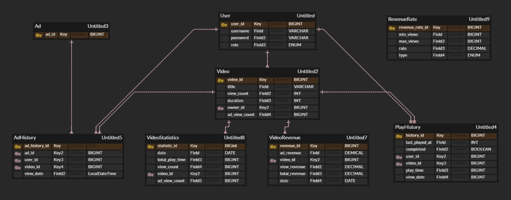

# Balance System

## 📋 프로젝트 개요
Balance System은 영상 콘텐츠 플랫폼의 백엔드 시스템으로, 유저가 영상을 재생하거나 정지하고 그에 따른 영상 및 광고의 정산·통계 수집을 통해 일간, 주간, 월간 단위로 통계·정산 데이터를 제공합니다.

### 🔍 주요 기능
- **JWT 인증**: JWT와 리프레시 토큰을 통한 유저 인증 및 권한 관리.
- **영상 기능**: 유저가 영상을 등록하고 재생 및 정지 가능.
- **통계 및 정산 관리**: 배치 작업으로 영상 및 광고의 재생 통계와 시청 수익을 정산.
- **동시성 제어**: Lua-script를 통한 영상 및 광고 조회수의 동시성 제어 및 어뷰징 방지 기능.

---

## 🛠 시스템 아키텍처
### 주요 구성 요소
- **Spring Boot**: 프로젝트의 주요 백엔드 프레임워크
- **Redis**: 영상 및 광고 조회 중복 방지와 동시성 제어
- **MySQL**: 유저, 영상 관련 정보 및 통계/정산 데이터 저장
- **QueryDSL**: 동적 쿼리 생성과  N+1문제 방지를 위해 사용
- **Spring Batch**: 통계 및 정산 배치 작업과 그에 따른 스케줄링 실행

### 디렉토리 구조
```
balance-system/
│
├── domain/
│   ├── content/
│   │   ├── ad/           # 광고 도메인 관련 클래스
│   │   ├── video/        # 영상 도메인 관련 클래스
│   │   ├── videohistory/ # 재생 이력 관리 클래스
│   │   └── adhistory/    # 광고 시청 이력 관리 클래스
│   └── user/             # 사용자 인증 및 JWT 관련 클래스
│
├── global/
│   ├── batch/            # 스케줄러 및 배치 프로세서
│   ├── config/           # Redis, JWT, QueryDSL 설정 파일
│   ├── jwt/              # JWT 생성 및 검증 관련 유틸리티 클래스
│   ├── revenuerate/      # 정산 단가 관리 클래스
│   ├── videorevenue/     # 정산 관리 클래스
│   └── videostats/       # 통계 관리 클래스
│
└── resources/
    ├── application.yml   # Redis 및 MySQL 설정
    └── view_increment.lua # 어뷰징과 조회수 증가에 관한 동시성 제어를 위한 Lua 스크립트
```

---

## 🚀 설치 및 실행
### 사전 준비 사항
- **Java 17**
- **Spring Boot 3.4**
- **MySQL**
- **Redis**
- **Docker**

### 설치 방법
1. **Repository 복제**
   ```bash
   git clone https://github.com/username/balance-system.git
   cd balance-system
   ```

2. **환경 변수 설정**
   - 프로젝트 루트 디렉토리에 `.env` 파일을 생성하여 필요한 환경 변수를 설정합니다.
   ```plaintext
   MYSQL_ROOT_PASSWORD=your_password
   MYSQL_PASSWORD=your_database_password
   SPRING_REDIS_PASSWORD=your_redis_password
   ```


3. **애플리케이션 설정**
   - `application.properties`에서 Redis와 MySQL 설정을 환경에 맞게 수정합니다.

4. **Docker 설정**
   ```bash
   docker-compose up -d
   ```

5. **애플리케이션 실행**
   ```bash
   ./mvnw spring-boot:run
   ```

---

## 📊 ERD 다이어그램




## 📚 API 명세서
| 메서드    | 엔드포인트                | 설명                                    | 요청 예시                                |
|-----------|---------------------------|-----------------------------------------|------------------------------------------|
| `POST`    | `/videos/{videoId}/play`  | 특정 유저가 영상을 재생               | `/videos/1/play?userId=1001`             |
| `POST`    | `/videos/{videoId}/pause` | 영상의 재생 중지                 | `/videos/1/pause?userId=1001&currentPlayedAt=120` |
| `GET`     | `/run-day-batch-job`      | 특정 날짜 배치 작업을 수동으로 실행 | `/run-day-batch-job?date=2023-11-01`   |
| `GET`     | `/revenues`               | 일/주/월 단위로 수익 데이터 조회        | `/revenues?period=month&date=2023-11-01`   |
| `GET`     | `/top5/view-count`        | 일/주/월 단위 조회수 상위 5개 영상 조회 | `/top5/view-count?date=2023-11-01`       |
| `GET`     | `/top5/play-time`         | 일/주/월 단위 재생 시간 상위 5개 영상 조회 | `/top5/play-time?date=2023-11-01`    |

---

## 📖 사용 예제
> **영상 재생 및 정지 API 예제**

### 1. 영상 재생
```http
POST /videos/{videoId}/play?userId={userId}
```
- **설명**: 특정 유저가 영상을 재생
- **응답 예시**:
  
   ```json
   "동영상을 처음부터 재생합니다."
   ```
   또는
  
  ```json
  "동영상을 {lastPlayedAt}초부터 이어서 재생합니다."

   ```

### 2. 영상 정지
```http
POST /videos/{videoId}/pause?userId={userId}&currentPlayedAt={playedAt}
```
- **설명**: 시청시간으로 영상 재생을 정지
- **응답 예시**:
  
   ```json
   "동영상 재생을 중단했습니다."
   ```

---

## 🧩 주요 코드 설명
### Redis와 Lua 스크립트를 통한 중복 조회 방지
**view_increment.lua**
```lua
local count_key = KEYS[1]         -- 조회수 또는 광고 시청 수를 증가시킬 키
local ttl_key = KEYS[2]           -- 중복 방지를 위한 TTL 키
local user_id = ARGV[1]           -- 사용자 ID 또는 고유 인증키
local owner_id = ARGV[2]          -- 영상 소유자 ID
local ttl_value = tonumber(ARGV[3])   -- TTL 시간 (초)
local increment_value = tonumber(ARGV[4]) -- 증가할 값 (1)

if user_id == owner_id then
    return -1  -- owner 재생으로 조회수 증가 안함
end

if redis.call("EXISTS", ttl_key) == 1 then
    return -2  -- 중복 요청으로 조회수 증가 안함
else
    redis.call("INCRBY", count_key, increment_value)
    redis.call("SET", ttl_key, "1", "EX", ttl_value)
    return redis.call("GET", count_key)  -- 증가된 조회수를 반환
end
```

### 배치 프로세스
스케줄링된 배치 작업으로 영상 및 광고의 재생 통계와 수익을 정산합니다.  
일별, 주별, 월별 통계를 통해 유저에게 통계와 정산 데이터를 제공합니다.

```java
@Bean
    public Job dayStatisticsJob() {
        return new JobBuilder("dayStatisticsJob", jobRepository)
                .incrementer(parameters -> new JobParametersBuilder(parameters)
                        .addString("date", LocalDate.now().toString())
                        .toJobParameters())
                .start(partitionedDayStatisticsStep())
                .next(partitionedDayRevenueStep())
                .listener(new DayBatchJobListener())
                .build();
    }
```
```java
@Scheduled(cron = "0 0 0 * * ?")
    public void runDayStatisticsJob() {
        try {
            JobParameters jobParameters = new JobParametersBuilder()
                    .addLong("time", System.currentTimeMillis())
                    .toJobParameters();
            jobLauncher.run(dayStatisticsJob, jobParameters);
        } catch (Exception e) {
            e.printStackTrace();
        }
    }
```

---

## ⚠️ Error 코드 및 예외 처리
| Error 코드 | 설명                        | 해결 방안                              |
|------------|-----------------------------|----------------------------------------|
| `401`      | JWT 인증 실패               | 유효한 JWT 토큰을 사용하거나 재발급    |
| `429`      | 중복 재생으로 인한 요청 제한 | 중복 재생 시 일정 시간 후에 재시도      |
| `500`      | 서버 내부 오류              | 서버 로그를 통해 원인 파악 및 수정     |

---
